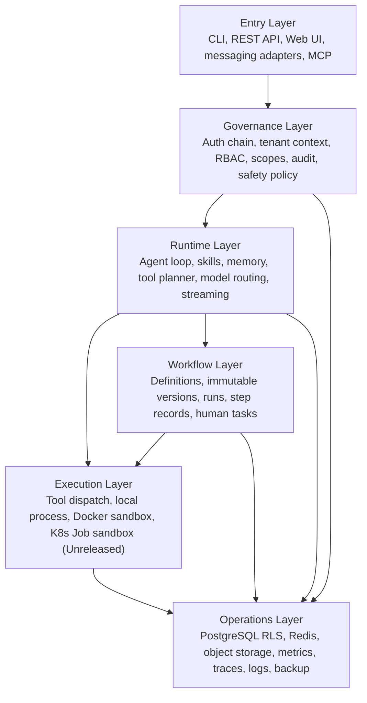
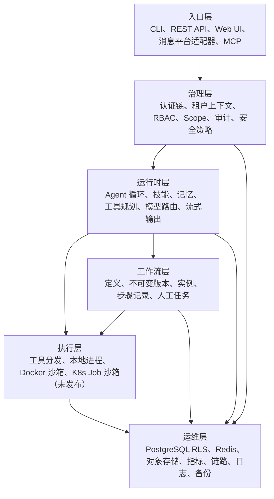

# Agent-first Architecture Overview

[English](#english) | [中文](#中文)

---

## English

**HermesX is an Agent-first Runtime Control Plane.** It treats agents as production workloads, not isolated demos: every entry point, model turn, tool call, workflow step, tenant boundary, and operational signal is part of one governed runtime.

### Positioning

HermesX sits between product surfaces and model/tool execution. Product teams call HermesX through CLI, REST, Web UI, messaging adapters, or MCP. HermesX then applies tenant identity, policy, runtime orchestration, workflow state, sandbox controls, and operational telemetry before any agent action reaches tools or infrastructure.

### Layer Map

### Layer Boundaries

| Layer | Owns | Does not own |
|-------|------|--------------|
| Entry | User and system entry points: CLI, REST, Web UI, messaging adapters, MCP | Tenant authority or tool execution decisions |
| Governance | Authentication, tenant derivation, RBAC, scopes, audit, safety checks | Business workflow semantics |
| Runtime | Agent turn loop, memory, skills, tool planning, model/provider routing, streaming | Persistent workflow versioning |
| Execution | Tool invocation, process isolation, Docker policy, K8s Job sandbox mode | Identity, tenant routing, or approval policy |
| Workflow | Fixed SOP definitions, immutable published versions, runs, step state, human tasks, retry/cancel semantics | General-purpose chat orchestration |
| Operations | Storage, RLS, Redis locks, object storage, metrics, traces, logs, backup/restore | Product-specific user experience |

### Runtime Contract

HermesX turns an agent request into a controlled execution record:

1. Entry receives a CLI, API, Web UI, platform adapter, or MCP request.
2. Governance derives tenant and actor from credentials, then applies RBAC, scopes, audit, and safety controls.
3. Runtime builds the agent context from messages, memory, skills, model settings, and tool availability.
4. Execution runs approved tools inside the configured isolation mode.
5. Workflow persists long-running SOP state when the request belongs to a workflow run or human task.
6. Operations records durable state, metrics, traces, logs, receipts, usage, and backup-relevant data.

### Release State

| Scope | State |
|-------|-------|
| Latest released baseline | `v2.3.0` |
| Current docs/API baseline | `v2.4.0-dev` |
| Unreleased examples | Eino 0.9 main path, admin usage aggregation, K8s Job sandbox, pre-built observability pack, Redis/MinIO backup scripts |

### Pointers

| Topic | Document |
|-------|----------|
| API contract | [api-reference.en.md](api-reference.en.md) |
| Workflow and human tasks | [workflow-guide.en.md](workflow-guide.en.md) |
| Security model | [SECURITY_MODEL.en.md](SECURITY_MODEL.en.md) |
| RBAC | [RBAC_MATRIX.en.md](RBAC_MATRIX.en.md) |
| Enterprise readiness | [ENTERPRISE_READINESS.en.md](ENTERPRISE_READINESS.en.md) |
| Changelog | [CHANGELOG.en.md](CHANGELOG.en.md) |

---

## 中文

**HermesX 是面向 Agent 的运行时控制平面。** 它把 Agent 当作生产工作负载，而不是孤立 demo：入口、模型轮次、工具调用、工作流步骤、租户边界和运维信号都属于同一个受治理运行时。

### 定位

HermesX 位于产品入口与模型/工具执行之间。产品团队可以通过 CLI、REST、Web UI、消息平台适配器或 MCP 调用 HermesX。HermesX 会在任何 Agent 动作到达工具或基础设施之前，先应用租户身份、策略、运行时编排、工作流状态、沙箱控制和运维遥测。

### 分层图

### 层边界

| 层 | 负责 | 不负责 |
|----|------|--------|
| 入口层 | CLI、REST、Web UI、消息平台、MCP 等用户或系统入口 | 租户授权或工具执行决策 |
| 治理层 | 认证、租户派生、RBAC、Scope、审计、安全检查 | 业务工作流语义 |
| 运行时层 | Agent 轮次、记忆、技能、工具规划、模型/Provider 路由、流式输出 | 持久化工作流版本管理 |
| 执行层 | 工具调用、进程隔离、Docker 策略、K8s Job 沙箱模式 | 身份、租户路由或审批策略 |
| 工作流层 | 固定 SOP 定义、发布版本、实例、步骤状态、人工任务、重试/取消语义 | 通用聊天编排 |
| 运维层 | 存储、RLS、Redis 锁、对象存储、指标、链路、日志、备份恢复 | 产品侧用户体验 |

### 运行时契约

HermesX 会把一次 Agent 请求变成受控执行记录：

1. 入口层接收 CLI、API、Web UI、平台适配器或 MCP 请求。
2. 治理层从凭证派生租户和操作者，并应用 RBAC、Scope、审计和安全控制。
3. 运行时层根据消息、记忆、技能、模型设置和可用工具构建 Agent 上下文。
4. 执行层在配置的隔离模式中运行已批准工具。
5. 工作流层在请求属于工作流实例或人工任务时持久化长流程状态。
6. 运维层记录持久状态、指标、链路、日志、执行回执、用量和备份相关数据。

### 发布状态

| 范围 | 状态 |
|------|------|
| 最新已发布基线 | `v2.3.0` |
| 当前文档/API 基线 | `v2.4.0-dev` |
| 未发布示例 | Eino 0.9 主链、Admin usage aggregation、K8s Job 沙箱、预置观测包、Redis/MinIO 备份脚本 |

### 相关文档

| 主题 | 文档 |
|------|------|
| API 契约 | [api-reference.md](api-reference.md) |
| 工作流与人工任务 | [workflow-guide.md](workflow-guide.md) |
| 安全模型 | [SECURITY_MODEL.md](SECURITY_MODEL.md) |
| RBAC | [RBAC_MATRIX.md](RBAC_MATRIX.md) |
| 企业就绪度 | [ENTERPRISE_READINESS.md](ENTERPRISE_READINESS.md) |
| Changelog | [CHANGELOG.md](CHANGELOG.md) |
