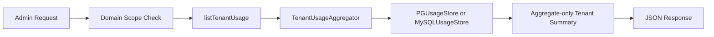
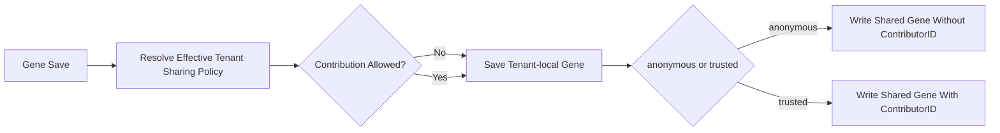
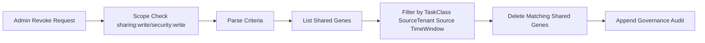

# Arch Design: Internal Platform Governance Remediation

> 任务：platform-governance-remediation  
> 日期：2026-05-22  
> 主责角色：architect / backend-engineer  
> 当前阶段：execute  
> 状态：implemented-for-review

---

## 目标与边界

本次设计不是重做整个平台，而是在现有多租户 SaaS 控制平面上补齐内部平台治理的最小可证明闭环，覆盖以下 4 个重点：

1. PostgreSQL / MySQL 双生产后端的企业支持口径统一。
2. 跨租户共享学习从隐式全局行为改为显式治理能力。
3. Admin 管理面从单一 `admin` scope 拆到分域 scope。
4. 跨租户 usage 聚合从 handler 直接关闭 RLS 改为 metering 聚合接口。

本次不包含：

- Web UI 的完整治理中心页面实现。
- 外部合规场景下的密码学防抵赖链式审计。
- 全量审批流、legal hold、保留期引擎。

---

## 系统边界

### 边界内

- `internal/api/admin/*` 管理接口与授权模型
- `internal/evolution/*` 共享学习策略与撤回
- `internal/metering/*` usage 聚合与双后端实现
- `internal/middleware/*` domain scope 权限守卫
- `docs/*` 与 `internal/api/openapi.go` 契约收敛
- `scripts/check_tenant_sql*.sh` 后端 SQL 静态护栏

### 边界外

- 第三方 IdP 角色映射的组织级治理流程
- 外部 SIEM、Grafana、工单审批系统接入
- 大规模 Web 控制台交互优化

---

## 关键设计决策

### 1. 双生产后端能力矩阵显式化

此前企业隔离叙事过度依赖 PostgreSQL RLS。本次把企业支持口径改成：

- PostgreSQL：`tenant_id` + RLS/FORCE RLS + Store tenant 参数 + 回归验证。
- MySQL：`tenant_id` + Store tenant 参数 + SQL 静态护栏 + 回归验证。

这意味着 MySQL 不再被 PostgreSQL 的数据库侧能力“代言”，而是单独给出验证入口和 runbook。

### 2. 共享学习采用“全局上限 + 租户策略”模型

共享学习允许存在，但必须受控。

- 全局策略：`disabled` / `anonymous` / `trusted`
- 租户策略：`consume_shared` + `contribution_mode` + `labels`
- 实际贡献等级取“全局上限”和“租户配置”的交集

这保证平台可以：

- 全局一键收紧共享等级
- 对敏感租户关闭贡献或关闭消费
- 对共享内容按条件执行撤回

### 3. 共享策略当前值与版本历史一并持久化

共享策略不再只保存在进程内存里。

- 当前值写入 evolution backend 的 current policy 表
- 每次变更追加一条 history 记录并递增 version
- 进程重启后由 `GeneStore.Open` 自动恢复 global / tenant sharing policy

这保证平台至少具备：

- 重启后策略不丢失
- 当前版本可审计
- 后续扩展 diff / rollback / Web 控制面时有稳定事实源

### 3. Admin 权限采用分域 scope

Admin 面不再统一依赖 `RequireScope("admin")`，改为按域控制：

- `tenant:*`
- `key:*`
- `billing:*`
- `usage:*`
- `audit:*`
- `sharing:*`
- `security:*`
- `ops:*`

旧 `admin` scope 仅作为 break-glass 兼容放行，不再代表日常最小权限模型。

### 4. 跨租户 usage 聚合下沉到 metering store

此前 handler 层直接执行跨租户高权限读取。现在统一要求通过 `metering.TenantUsageAggregator` 读取聚合结果：

- handler 不再自己关闭 RLS
- PostgreSQL / MySQL 各自提供聚合实现
- 返回值限定为 aggregate-only tenant summary

---

## 组件设计

### A. Governance Admin API

核心入口：`internal/api/admin/handler.go`

职责：

- 将各管理域拆为独立路由和独立 scope
- 接入 evolution sharing policy / revoke 能力
- 接入 aggregate-only usage endpoints
- 保留 legacy `admin` 兼容但不作为主模型

### B. Evolution Governance Layer

核心入口：`internal/evolution/store.go`, `internal/evolution/policy.go`, `internal/api/admin/evolution.go`

职责：

- 管理全局 sharing mode
- 管理租户级 sharing policy
- 在本地 gene 与 shared gene 之间做受控复制
- 支持按 task class / source tenant / source / 时间窗执行撤回

### C. Metering Aggregation Layer

核心入口：`internal/metering/store.go`, `internal/metering/pg_store.go`, `internal/metering/mysql_store.go`

职责：

- 提供 tenant summary 聚合接口
- 隐藏后端差异
- 为 Admin usage 提供脱敏的跨租户视图

### D. Backend Validation Surface

核心入口：`docs/database.md`, `docs/runbooks/backend-enterprise-validation-matrix.md`, `scripts/check_tenant_sql.sh`, `scripts/check_tenant_sql_mysql.sh`

职责：

- 固化 PostgreSQL / MySQL 双后端门禁
- 将隔离、审计、GDPR、usage、workflow 的证明方式文档化

---

## 关键数据流

### 1. Admin usage 聚合

### 2. 共享学习写入

### 3. 共享学习撤回

---

## 主要接口约定

### Evolution Governance

- `GET /admin/v1/evolution/sharing-policy`
- `PUT /admin/v1/evolution/sharing-policy`
- `GET /admin/v1/evolution/tenants/{id}/sharing-policy`
- `PUT /admin/v1/evolution/tenants/{id}/sharing-policy`
- `POST /admin/v1/evolution/shared-knowledge/revoke`

### Usage Governance

- `GET /admin/v1/usage`
- `GET /admin/v1/usage/tenants`
- `GET /v1/usage`
- `GET /v1/usage/details`

### Domain Scope Model

示例：

- `billing:read`, `billing:write`
- `usage:read`, `usage:read:all`
- `sharing:read`, `sharing:write`
- `security:read`, `security:write`
- `ops:read`, `ops:write`

---

## 风险与约束

| 风险/约束 | 说明 | 当前处理 |
| --------- | ---- | -------- |
| 共享策略多实例刷新仍依赖进程内缓存 | 当前值与版本历史已持久化，但跨实例即时刷新还未实现 | 已收口单实例重启恢复与版本历史，后续补主动 reload / watcher |
| `admin` 兼容 scope 仍然存在 | 便于老调用方兼容，但权限仍偏宽 | 明确降级为 break-glass 兼容，不再作为设计中心 |
| MySQL 不具备 PostgreSQL RLS | 隔离证明必须依赖 Store + SQL guard + 测试 | 已补 validation matrix 和 MySQL guard 脚本 |
| Web UI 治理中心未完成 | 当前以 API 和 runbook 为主 | 暂通过 API + 文档 + OpenAPI 收口 |

---

## 当前结论

本次整改已把“内部平台治理”的最小骨架从计划推进到实现：

- 双后端企业支持矩阵已显式化。
- 共享学习已具备显式策略、撤回和审计入口。
- Admin 权限已从单一 `admin` scope 拆到分域 scope。
- 跨租户 usage 已改为聚合接口模型。

后续阶段应继续补齐：

- 策略持久化与回滚版本化
- Web 治理中心
- 更完整的 release gate 与恢复演练
