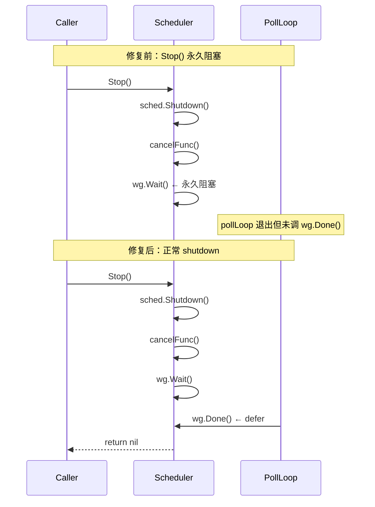
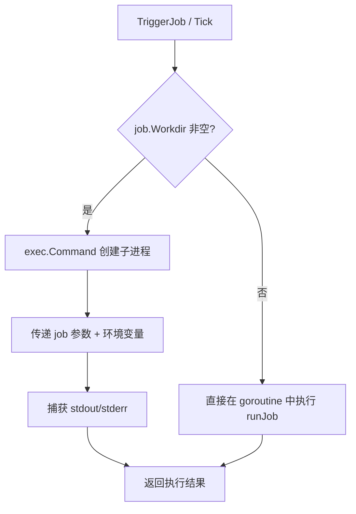

# Arch Design — Go Architecture Remediation

**slug:** go-arch-remediation  
**状态:** plan  
**主责角色:** architect  
**日期:** 2026-07-31

---

## 修复影响面分析

### 系统边界

本次修复不改变 HermesX 的系统边界、外部依赖或集成点。所有变更都在内部实现层面，不涉及：
- API 契约变更
- 数据库 schema 变更
- 外部服务集成变更
- 部署拓扑变更

### 受影响组件

```
┌─────────────────────────────────────────────────────┐
│                    cmd/hermesx/saas.go               │
│                    (A1: 错误处理)                     │
└────────┬──────────────────────────────┬──────────────┘
         │                              │
         ▼                              ▼
┌─────────────────┐          ┌─────────────────────┐
│  internal/api/  │          │  internal/config/   │
│  (A1: os.Exit)  │          │  (A4: Save 脱敏)    │
└─────────────────┘          └─────────────────────┘
         │
         ▼
┌─────────────────────────────────────────────────────┐
│               internal/middleware/                    │
│         (A2: context propagation)                    │
└─────────────────────────────────────────────────────┘

┌─────────────────┐          ┌─────────────────────┐
│ internal/sched/ │          │ internal/cron/      │
│ (S1: WaitGroup) │          │ (S2: os.Chdir)      │
└─────────────────┘          └─────────────────────┘

┌─────────────────┐          ┌─────────────────────┐
│ internal/batch/ │          │ internal/mcpcatalog/│
│ (A5: LLM 超时)  │          │ (B4: error log)     │
└─────────────────┘          └─────────────────────┘

多处 (A3: error wrapping)
├── internal/tools/docgen_sandbox.go
├── internal/tools/approval.go
├── internal/auth/jwt.go
├── internal/store/factory.go
└── internal/agent/credential_rotation.go
```

---

## 关键数据流变更

### S1: Scheduler Shutdown 流程（修复前 vs 修复后）



### S2: Cron Job 执行模式（修复后）



---

## 修复方案详细设计

### S1: WaitGroup 修复

**文件:** `internal/scheduler/scheduler.go`

**变更:**
```go
// 修复前（第 136 行）
go s.pollLoop(s.ctx)

// 修复后
s.wg.Add(1)
go s.pollLoop(s.ctx)

// pollLoop 函数开头添加
func (s *SaasScheduler) pollLoop(ctx context.Context) {
    defer s.wg.Done()
    // ... 原有逻辑
}
```

**影响面:** 仅 `scheduler.go`，不影响外部调用方。  
**测试:** 新增 `TestSaasSchedulerStop` 验证 Stop() 在 5s 内返回。

### S2: os.Chdir 修复

**前置条件:** S2-audit 确认 cron job 依赖模式。

**方案 A（推荐——exec.Command）:**
```go
// 修复后
func (s *Scheduler) runJob(job *Job) (...) {
    if job.Workdir != "" {
        cmd := exec.CommandContext(ctx, "sh", "-c", job.Command)
        cmd.Dir = job.Workdir
        // 传递环境变量、捕获输出
    }
}
```

**方案 B（备选——per-goroutine 文件描述符）:**
如果 job 依赖进程内状态（如数据库连接），不能用 exec.Command，改为在 goroutine 内通过 `syscall.Chdir` + `defer` 恢复，但需要加 mutex 保护 CWD。

### A1: os.Exit 移除

**文件:** `internal/api/server.go:395`

```go
// 修复前
if cfg.AllowedOrigins == "*" && env == "production" {
    slog.Error("CORS wildcard '*' is not allowed in production")
    os.Exit(1)
}

// 修复后
if cfg.AllowedOrigins == "*" && env == "production" {
    return nil, fmt.Errorf("CORS wildcard '*' is not allowed in production; set AllowedOrigins to specific domains")
}
```

**调用方处理:** `saas.go` 的 `RunE` 会自动将 error 传播到 Cobra，Cobra 会以 exit code 1 退出。

### A2: Context 传播修复

**文件:** `internal/middleware/redis_ratelimiter.go:51`

```go
// 修复前
func (l *RedisRateLimiter) Allow(key string, limit int, window time.Duration) bool {
    ctx := context.Background()
    // ...

// 修复后
func (l *RedisRateLimiter) Allow(ctx context.Context, key string, limit int, window time.Duration) bool {
    // 使用传入的请求 context
```

**接口变更:** `RateLimiter` 接口的 `Allow` 方法签名变更，需要更新所有调用方。

### A4: Config.Save() 脱敏

**文件:** `internal/config/config.go:297`

```go
// 修复后
func (c *Config) Save() error {
    redacted := c.clone()
    redacted.APIKey = maskSecret(redacted.APIKey)
    redacted.ObjStore.AccessKey = maskSecret(redacted.ObjStore.AccessKey)
    redacted.ObjStore.SecretKey = maskSecret(redacted.ObjStore.SecretKey)
    // ... 写入 redacted 版本
}

func maskSecret(s string) string {
    if s == "" { return "" }
    if len(s) <= 8 { return "****" }
    return s[:4] + "****" + s[len(s)-4:]
}
```

**保留 `SaveFull()`:** 提供完整保存的逃生舱方法。

---

## 接口约定变更

| 接口 | 变更 | 影响 |
|------|------|------|
| `RateLimiter.Allow` | 新增 `ctx context.Context` 参数 | 需更新所有调用方（middleware chain） |
| `Config.Save` | 行为变更（脱敏） | 调用方无需修改，但输出内容变化 |
| `APIServer.NewAPIServer` | 返回值新增 `error` | 需更新 `saas.go` 调用 |

---

## 技术选型

| 决策点 | 选择 | 原因 |
|--------|------|------|
| S2 修复方案 | exec.Command（首选） | 最安全的并发隔离，不改变进程全局状态 |
| LLM 超时值 | 120s | 平衡长请求和资源占用，可配置化 |
| 错误脱敏方式 | maskSecret（前 4 后 4） | 保留足够调试信息，不泄露完整密钥 |
| PR 拆分策略 | 3 个 PR | 降低 review 难度，支持独立回滚 |

---

## 风险与约束

| 风险 | 约束 | 缓解 |
|------|------|------|
| S2 exec.Command 需要 fork 权限 | Docker 默认允许 fork | K8s 环境验证 |
| A2 接口变更影响面 | RateLimiter 被多处调用 | 编译器会捕获所有遗漏 |
| A4 脱敏后配置迁移 | 某些场景需要完整配置 | 保留 SaveFull() |
