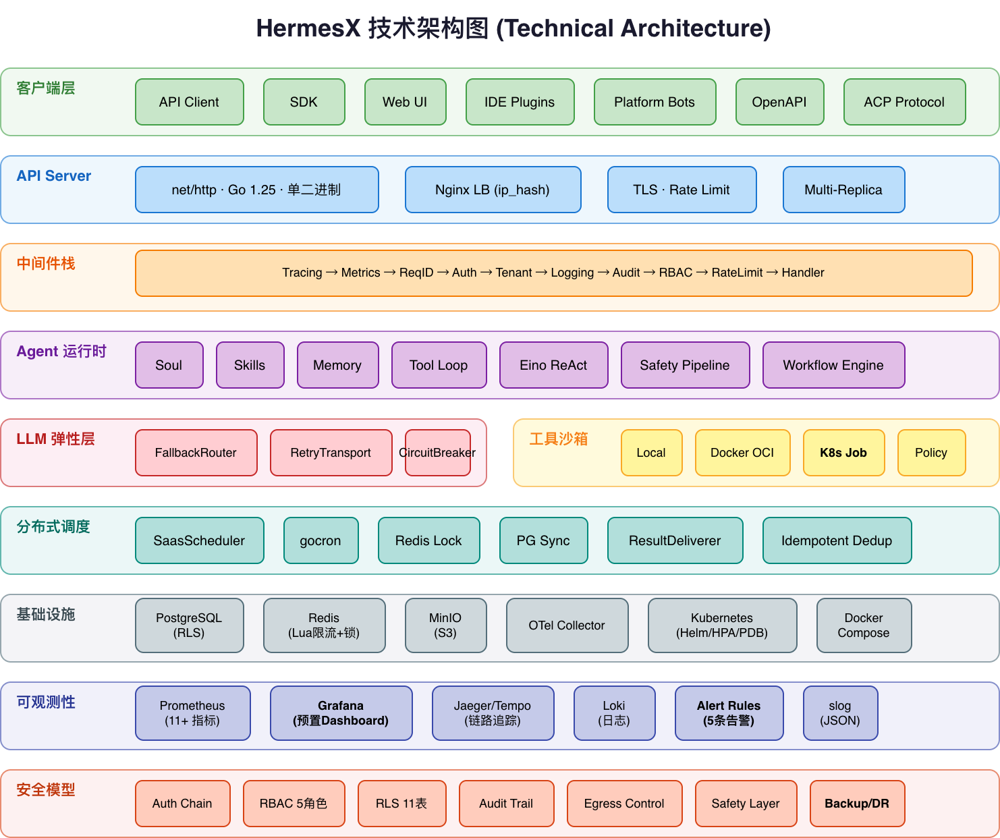
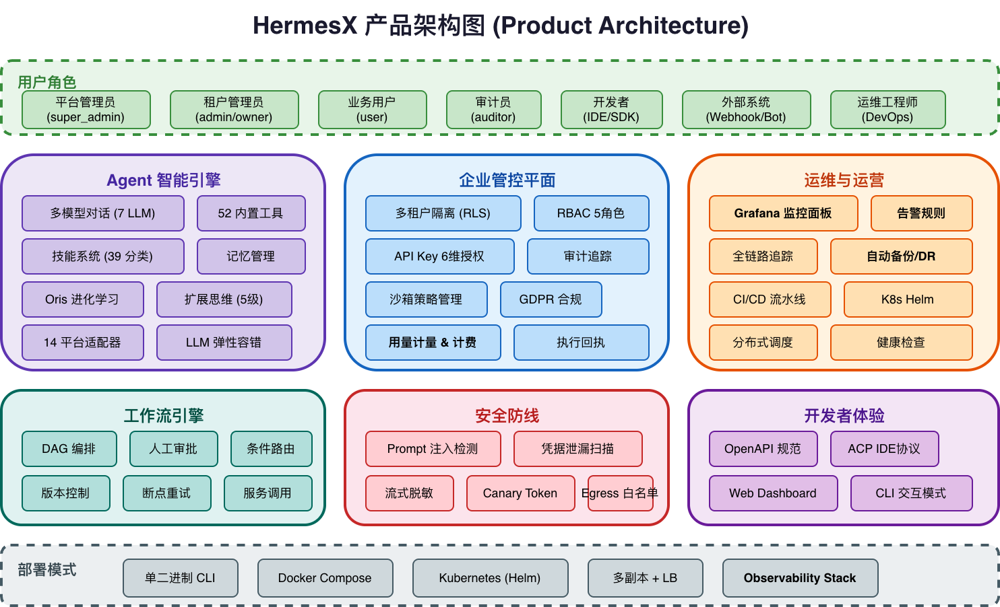
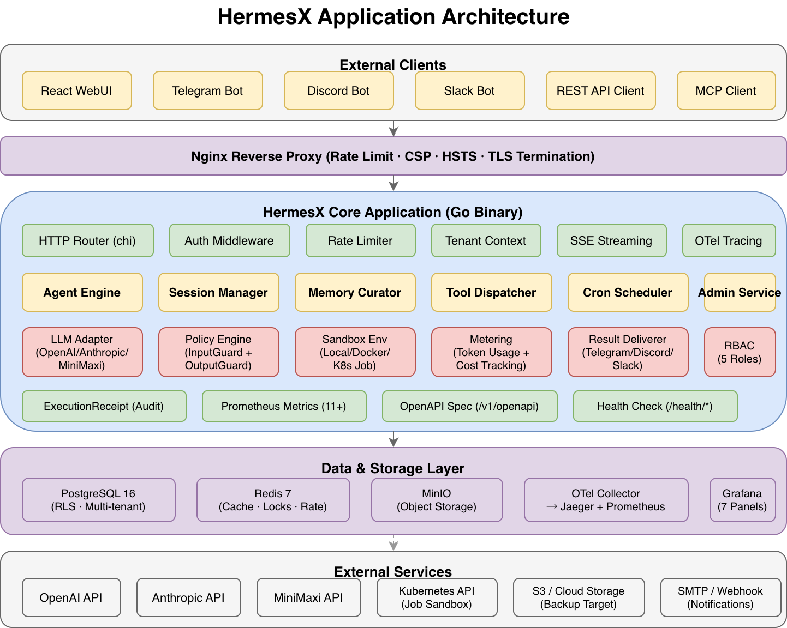
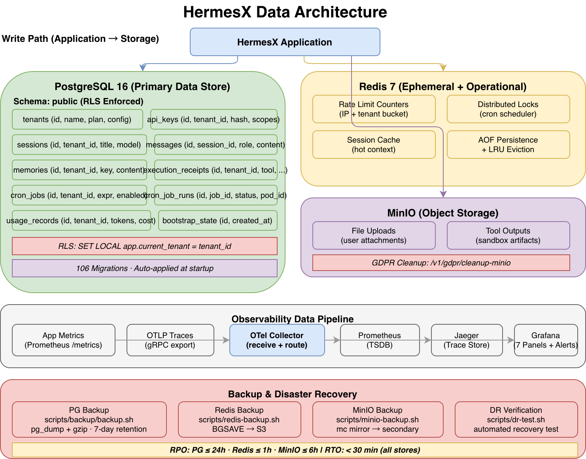

# HermesX

**企业级 Agent 运行时 & 多租户 SaaS 控制平面**

面向企业规模的 AI Agent 部署、隔离和治理的生产级平台。使用 Go 构建，单二进制部署、原生并发、零依赖分发。

> 最初受 Nous Research 的 [hermes-agent](https://github.com/NousResearch/hermes-agent) 启发。HermesX 已演进为独立的企业平台，具备多租户隔离、RBAC、审计追踪、沙箱执行和 SaaS 级可观测性——远超原始 Agent 框架的能力边界。

---

## 架构概览

### 技术架构



### 产品架构



### 应用架构



### 数据架构



> draw.io 源文件位于 [`docs/diagrams/`](diagrams/) 目录，可用 [draw.io](https://app.diagrams.net/) 或 VS Code draw.io 插件打开编辑。

| 层级 | 组件 |
|------|------|
| 客户端 | API Client · SDK · Web UI · Telegram · Discord · Slack · MCP |
| API Server | net/http · Go 1.25 · 单二进制 |
| 中间件栈（10层） | Tracing → Metrics → RequestID → Auth → Tenant → Logging → Audit → RBAC → RateLimit → Handler |
| Agent 运行时 | Soul · Skills · Memory · Tool Loop · 多模态路由 · 上下文压缩 |
| Eino Agent 运行时 | EinoAgent（ReAct Graph）· Safety Pipeline · ToolAdapter · ModelAdapter · Workflow EinoExecutor |
| LLM 弹性层 | FallbackRouter → RetryTransport → CircuitBreaker → LLM API |
| 工具沙箱 | Policy Check · 本地进程 · Docker OCI（--net=none）· K8s Job |
| 分布式调度 | SaasScheduler · gocron · Redis Lock · PG 同步 · ResultDeliverer |
| 基础设施 | PostgreSQL（RLS）· Redis（Lua 限流 + 分布式锁）· MinIO（S3）· OTel Collector |
| 可观测性 | Loki · Jaeger/Tempo · Prometheus · Grafana（7 面板 + 5 告警规则） |
| 安全模型 | 认证链 · RBAC · RLS（FORCE RLS）· 审计 · 沙箱 · Egress（Redirect 防护 · SSRF 闭合）· Safety Layer（注入防御 · 泄漏扫描 · 流式脱敏 · MCP 采样门控）|

---

## 快速链接

| | |
|---|---|
| [SaaS 快速开始](saas-quickstart.md) | 几分钟内启动一个租户 |
| [API 参考](api-reference.md) | 完整端点文档 |
| [架构概览](architecture.md) | 系统设计与组件地图 |
| [配置说明](configuration.md) | 所有环境变量与配置项 |
| [部署指南](deployment.md) | Docker、Kubernetes 及裸机部署 |
| [安全模型](SECURITY_MODEL.md) | 威胁模型、RLS、沙箱隔离 |
| [RBAC 矩阵](RBAC_MATRIX.md) | 5 角色 × 10 资源权限矩阵 |
| [技能指南](skills-guide.md) | 技能系统使用手册 |
| [工作流引擎指南](workflow-guide.md) | 固定 SOP 工作流使用手册 |
| [调度器指南](scheduler-guide.md) | 分布式调度部署与测试 |

---

## 项目数据

| 指标 | 数值 |
|------|------|
| Go 源文件 | 413+ 个 |
| 代码行数 | 78,000+ 行 |
| 注册工具 | 52 个（42 核心 + 10 RL 训练） |
| 平台适配器 | 14 个 |
| 终端后端 | 8 个 |
| LLM 提供商 | 7 个 |
| 内置技能分类 | 39 个目录 |
| 测试文件 | 127 个 |
| 测试总数 | 1,828 个 |
| RLS 保护表 | 11 个 |
| API 端点 | 51+ 个 |
| 版本 | v2.3.0 |

---

## 核心能力

### 企业 SaaS 平台

- **多租户隔离** — PostgreSQL 行级安全（RLS），每事务 `SET LOCAL app.current_tenant`，11 张 RLS 保护表（含 `FORCE ROW LEVEL SECURITY`）
- **认证链** — 静态 Token → API Key（SHA-256 哈希）→ JWT/OIDC，多层降级
- **API Key 作用域** — `read` / `write` / `execute` / `admin` / `audit` / `gdpr` 六维细粒度授权
- **5 种角色** — `super_admin`、`admin`、`owner`、`user`、`auditor`，覆盖所有操作路径
- **双层限流** — 原子 Redis Lua 脚本（租户 + 用户滑动窗口），Redis 故障自动降级本地 LRU
- **Token 用量计量** — 异步批量持久化，DB 优先 + 硬编码双层成本计算，支持自定义定价规则
- **执行回执** — 可审计的工具调用记录，含幂等去重和 OpenTelemetry 链路追踪关联
- **审计追踪** — 所有状态变更操作的不可变日志，支持跨租户查询（`super_admin`）
- **GDPR 合规** — 全链路数据导出（JSON）+ 事务性删除 + MinIO 对象存储清理
- **沙箱隔离** — 按租户的代码执行环境，支持本地进程 / Docker / K8s Job 三种模式（`SANDBOX_MODE` 环境变量切换），Docker 网络/资源限制，可通过 Admin API 管理策略
- **引导保护** — Bootstrap 端点双重 IP 限速（应用层 + Nginx），跨副本幂等
- **分布式定时调度** — gocron + Redis 分布式锁实现多 Pod 定时任务执行，PG 轮询同步、幂等去重、SECURITY DEFINER 跨租户清理、结果自动投递回源平台

### Admin API

| 端点 | 说明 |
|------|------|
| `GET /admin/v1/bootstrap/status` | 引导状态（公开） |
| `POST /admin/v1/bootstrap` | 初始化平台（ACP Token 鉴权） |
| `GET/POST /admin/v1/tenants/{id}/sandbox-policy` | 沙箱策略 CRUD |
| `DELETE /admin/v1/tenants/{id}/sandbox-policy` | 删除沙箱策略 |
| `GET/POST /admin/v1/tenants/{id}/api-keys` | 租户 API Key 管理 |
| `POST /admin/v1/tenants/{id}/api-keys/{kid}/rotate` | 轮换 API Key |
| `DELETE /admin/v1/tenants/{id}/api-keys/{kid}` | 吊销 API Key |
| `GET /admin/v1/pricing-rules` | 查询定价规则 |
| `PUT/DELETE /admin/v1/pricing-rules/{model}` | 更新/删除模型定价 |
| `GET /admin/v1/audit-logs` | 跨租户审计日志 |
| `GET /admin/v1/usage/tenants` | 租户用量汇总 |
| `GET /admin/v1/usage` | 按租户聚合用量（支持 daily/monthly 粒度、时间范围过滤） |
| `GET/PUT /admin/v1/evolution/sharing-policy` | 全局共享学习策略 |
| `GET /admin/v1/evolution/sharing-policy/history` | 全局共享学习策略历史 |
| `POST /admin/v1/evolution/sharing-policy/rollback` | 全局共享学习策略版本回滚 |
| `GET/PUT /admin/v1/evolution/tenants/{id}/sharing-policy` | 租户共享学习策略 |
| `GET /admin/v1/evolution/tenants/{id}/sharing-policy/history` | 租户共享学习策略历史 |
| `POST /admin/v1/evolution/tenants/{id}/sharing-policy/rollback` | 租户共享学习策略版本回滚 |
| `POST /admin/v1/evolution/shared-knowledge/revoke` | 共享知识撤回 |

### Tenant API（v1）

| 端点 | 说明 |
|------|------|
| `POST /v1/chat/completions` | OpenAI 兼容聊天接口 |
| `POST /v1/agent/chat` | 原生 Agent 流式聊天 |
| `GET/POST/DELETE /v1/tenants` | 租户管理 |
| `GET/POST/DELETE /v1/api-keys` | API Key 自助管理 |
| `GET /v1/audit-logs` | 当前租户审计日志 |
| `GET/DELETE /v1/execution-receipts/{id}` | 工具执行回执 |
| `GET /v1/usage` | 当前租户用量 |
| `GET /v1/me` | 当前身份信息 |
| `GET/DELETE /v1/memories/{id}` | 记忆管理 |
| `GET /v1/sessions/{id}` | 会话历史 |
| `GET/POST/PUT/DELETE /v1/skills/{id}` | 技能 CRUD |
| `GET /v1/gdpr/export` | 数据导出（GDPR） |
| `DELETE /v1/gdpr/data` | 数据删除（GDPR） |
| `POST /v1/gdpr/cleanup-minio` | 清理对象存储 |
| `GET/POST/PUT /v1/workflow-definitions` | 工作流定义管理 |
| `POST /v1/workflow-definitions/{id}/publish` | 发布工作流版本 |
| `POST/GET /v1/workflow-runs` | 启动/查询工作流实例 |
| `GET /v1/workflow-runs/{id}` | 工作流实例详情 |
| `POST /v1/workflow-runs/{id}/cancel` | 取消工作流实例 |
| `POST /v1/workflow-runs/{id}/retry` | 重试暂停的实例 |
| `GET /v1/workflow-tasks` | 查询待处理人工任务 |
| `POST /v1/workflow-tasks/{id}/complete` | 完成人工任务 |
| `GET /v1/openapi` | OpenAPI 规范 |
| `GET /health/live` / `GET /health/ready` | 健康检查 |
| `GET /metrics` | Prometheus 指标 |

---

### Agent 运行时

#### 工具（52 个）

**浏览器自动化（11 个）**

`browser_navigate` · `browser_snapshot` · `browser_click` · `browser_type` · `browser_scroll` · `browser_back` · `browser_press` · `browser_get_images` · `browser_vision` · `browser_console` · `browser_close`

支持本地 Playwright 和 Browserbase 云端两种后端，含视觉感知（截图 + GPT-4V 分析）。

**文件操作（5 个）**

`read_file` · `write_file` · `patch` · `search_files` · `file_state`

`file_state` 支持快照和差异追踪，`patch` 支持统一 diff 格式。

**终端 & 进程（2 个）**

`terminal` · `process`

全平台 PTY 支持（Unix/macOS/Windows），含危险命令检测和自动拦截。

**Web（3 个）**

`web_search` · `web_extract` · `web_crawl`

URL 安全检测（`url_safety`），防止 SSRF 和恶意重定向。

**视觉 & 媒体（3 个）**

`vision_analyze` · `image_generate` · `text_to_speech`

**记忆 & 上下文（3 个）**

`memory` · `session_search` · `todo`

`memory` 含 Curator 自动去重（O(n) 精确去重 + 内容相似性扫描）。

**技能管理（3 个）**

`skills_list` · `skill_view` · `skill_manage`

**Agent 协作（3 个）**

`delegate_task` · `mixture_of_agents` · `clarify`

`delegate_task` 最多并发 8 个子 Agent goroutine；`mixture_of_agents` 支持多模型集成投票。

**代码执行（1 个）**

`execute_code` — 沙箱隔离执行（Python/Bash），支持 `local` / `docker` / `k8s-job` 三种后端（通过 `SANDBOX_MODE` 切换），含资源限制、环境变量清理、输出截断。K8s Job 模式无需特权容器，兼容 GKE Autopilot / EKS Fargate。

**平台消息（3 个）**

`send_message` · `discord_send` · `discord_search`

**智能家居（4 个）**

`ha_list_entities` · `ha_get_state` · `ha_list_services` · `ha_call_service`

**定时任务（1 个）**

`cronjob` — 支持 Cron 表达式、持久化调度、多租户隔离。

**RL 训练（10 个，扩展）**

`rl_list_environments` · `rl_select_environment` · `rl_get_current_config` · `rl_edit_config` · `rl_start_training` · `rl_check_status` · `rl_stop_training` · `rl_get_results` · `rl_list_runs` · `rl_test_inference`

---

#### 平台适配器（14 个）

| 平台 | 说明 |
|------|------|
| Telegram | Bot API，支持文件 & 媒体 |
| Discord | Bot Gateway，含频道搜索 |
| Slack | Socket Mode / Webhook |
| WhatsApp | Cloud API |
| Signal | Signal CLI |
| Email | SMTP/IMAP |
| Matrix | Element 协议 |
| Mattermost | REST API |
| DingTalk | 钉钉机器人 |
| Feishu | 飞书机器人 |
| WeCom | 企业微信应用 |
| Weixin | 微信公众号 |
| DMwork | 企业 IM |
| API Server | HTTP Webhook 模式 |

#### LLM 提供商（7 个）

| 提供商 | 说明 |
|--------|------|
| OpenAI | GPT-4o、o3、o4 等 |
| Anthropic | Claude 4 Opus/Sonnet/Haiku，含提示缓存 |
| Google / Gemini | Gemini 2.5 Pro/Flash |
| OpenRouter | 统一多模型路由 |
| AWS Bedrock | 原生凭据链，无密钥管理 |
| Nous Research | Inference API |
| Custom | 任意兼容 OpenAI 格式的端点 |

支持推理模型（Claude 3.7/Sonnet 4/Opus 4、o1/o3/o4、DeepSeek-r1、QwQ），模型别名自动解析（`opus`、`sonnet`、`flash`、`r1` 等）。

#### 终端后端（8 个）

`local`（本地 PTY）· `docker`（容器隔离）· `ssh`（远程机器）· `modal`（Modal 云）· `daytona`（Daytona 开发环境）· `singularity`（HPC 容器）· `persistent_shell`（持久 Shell 会话）· PTY Unix/Windows

#### LLM 弹性

- **FallbackRouter** — 主 LLM 故障时自动切换备用提供商
- **RetryTransport** — 指数退避重试（可配置次数和延迟）
- **CircuitBreaker** — 按模型独立熔断，防止雪崩

---

### 基础设施

- **单二进制** — 零运行时依赖，`CGO_ENABLED=0` 可交叉编译至任意 OS/架构
- **多副本就绪** — 已验证 3 副本 + Nginx `ip_hash` 负载均衡，Bootstrap 幂等
- **Kubernetes 就绪** — Helm Chart 含 PDB、HPA、保守缩容策略
- **备份与恢复** — PostgreSQL pgBackRest PITR（RPO < 5min，RTO < 1h）+ Redis BGSAVE + S3（RPO < 15min）+ MinIO mc mirror（RPO < 1h），含自动化备份脚本和灾难恢复验证（`scripts/dr-test.sh`）
- **CI/CD** — GitHub Actions（单元 + 集成 + Race 检测 + 覆盖率 + Docker 推送）
- **可观测性** — Prometheus 11+ 自定义指标、OpenTelemetry 全链路追踪（HTTP→中间件→存储→LLM）、结构化 JSON 日志（slog）、预置 Grafana Dashboard（HTTP/LLM/熔断器/限流）、Prometheus 告警规则（5 条）、OTel Collector 配置，一键部署 `docker-compose.observability.yml`

---

## Agent 智能进化

### Oris Evolution 系统

行为基因（Gene）学习与回放机制，在普通 SelfImprover 之外提供独立的进化路径。

**工作原理：**

1. **任务分类** — `DetectTaskClass` 从首条用户消息和工具调用历史中自动推断任务类型（调试、功能、分析、写作、通用等）
2. **策略提炼** — 对话完成后异步调用辅助 LLM，将成功的行为模式提炼为单条基因（含置信度评分）
3. **Pre-Turn 增强** — 下次同类任务开始前，自动注入高置信度策略摘要，引导 Agent 复用已验证经验
4. **安全隔离** — 基因按 `tenantID + taskClass + insight` 的 SHA-256 派生 ID 存储，租户间严格隔离（防 B2 跨租户污染），注入前经 prompt injection 清洗（防 B1 注入攻击）

**存储后端：** SQLite（本地单机）或 MySQL（多节点），可通过配置切换。

**配置：**

```yaml
# ~/.hermes/config.yaml
evolution:
  enabled: true
  storage_mode: "sqlite"     # sqlite 或 mysql
  db_path: ""                # 空 = SQLite 默认路径
  mysql_dsn: ""              # storage_mode=mysql 时必填
  min_confidence: 0.7        # 低于此阈值的基因不参与回放
  max_genes_prompt: 3        # 每轮最多注入的策略数
  sharing_mode: "disabled"   # disabled / anonymous / trusted
```

---

### Batch 轨迹生成

并行运行多个 Prompt，批量收集 Agent 轨迹数据，用于评估、微调或 RL 数据集构建。

**特性：**

- goroutine 池控制（默认 4 并发，可配置）
- 每个 Prompt 独立运行完整 Agent 循环（含工具调用）
- 轨迹自动持久化到 `~/.hermes/batch_output`（JSON Lines 格式）
- 生成摘要报告（成功率、平均轮次、总 Token 消耗）

**配置：**

```go
BatchConfig{
    Prompts:       []string{"任务1", "任务2", ...},
    Model:         "sonnet",
    MaxWorkers:    8,
    MaxIterations: 30,
    OutputDir:     "./trajectories",
    ToolSets:      []string{"file", "terminal"},
}
```

---

## 开发者工具

### ACP 服务器（Agent Communication Protocol）

面向编辑器的本地 Agent 集成协议，支持 VS Code、Zed、JetBrains 等 IDE 插件通过 HTTP 与 Agent 交互。

**API 端点：**

| 端点 | 说明 |
|------|------|
| `GET /v1/health` | 服务健康检查（公开） |
| `POST /v1/chat` | 发起 Agent 对话 |
| `GET /v1/status` | Agent 运行状态 |
| `POST /v1/tool` | 直接调用工具 |
| `GET /v1/tools` | 列出可用工具 |
| `POST/GET /v1/sessions` | 会话创建与列表 |
| `GET/DELETE /v1/sessions/{id}` | 会话查询与删除 |
| `GET /v1/events?session_id=X` | SSE 实时事件流 |

**SSE 事件推送：** EventBroker 为每个 session 维护独立订阅通道（缓冲 32），实时推送 Agent 思考、工具调用和响应事件。

**鉴权：** Bearer Token（由 `ACP_TOKEN` 环境变量配置，空值 = 开发模式无鉴权）。

---

### Dashboard 管理界面

内嵌 Web 管理 UI，提供会话、配置、技能、网关的可视化管理。

**功能：**

- 会话列表与历史消息查看
- 运行时配置查看
- 技能列表与管理
- 网关连接状态

**部署：** Dashboard 作为可选模块独立启动，端口可配置，SPA 静态资源内嵌到二进制中。

**鉴权：** Write 操作需 Bearer Token；空值时进入开发无鉴权模式。

---

## 固定 SOP 工作流引擎

将多个 Agent 任务、HTTP 服务调用和条件分支编排为可持久化、可审计的 DAG 工作流，支持人工介入和断点重试。

> 完整使用指南：[工作流引擎指南](workflow-guide.md)

### 节点类型

| 类型 | 说明 |
|------|------|
| `start` | 流程起点，自动完成 |
| `agent_task` | 调用完整 Agent 循环（Eino ReAct Graph + 安全管线），通过 `config.prompt` 传入任务指令 |
| `service_task` | HTTP 调用外部服务，支持自定义 Method/Header/Body，响应 JSON 自动合并到步骤输出 |
| `human_task` | 暂停流程等待人工操作，通过 `/v1/workflow-tasks/{id}/complete` 继续，可携带 outcome + 变量更新 |
| `end` | 流程终点，自动完成 |

### Graph JSON 示例

```json
{
  "nodes": [
    {"id":"start","type":"start","name":"开始"},
    {"id":"ai_check","type":"agent_task","name":"AI 预审",
     "config":{"prompt":"审核申请合规性：{{input.description}}"}},
    {"id":"approve","type":"human_task","name":"主管审批",
     "config":{"assignee":"manager"}},
    {"id":"notify","type":"service_task","name":"发送通知",
     "config":{"url":"https://api.example.com/notify","method":"POST"}},
    {"id":"end_ok","type":"end","name":"通过"},
    {"id":"end_reject","type":"end","name":"拒绝"}
  ],
  "edges": [
    {"from":"start","to":"ai_check"},
    {"from":"ai_check","to":"approve"},
    {"from":"approve","to":"notify","condition":{"outcome":"approved"}},
    {"from":"approve","to":"end_reject","condition":{"outcome":"rejected"}},
    {"from":"notify","to":"end_ok"}
  ]
}
```

### 条件路由

边（Edge）支持两级筛选：

- **Outcome 匹配** — 上游步骤的 `outcome` 字段（如 `approved` / `rejected`）
- **条件表达式** — 支持 `eq`、`ne`、`gt`、`gte`、`lt`、`lte`、`exists`、`contains`、`startsWith`、`endsWith`

路径语法：`input.field`、`variables.key`、`steps.{nodeID}.output.field`（支持嵌套点号访问）

### 实例生命周期

```
running → waiting（等待人工）→ running → completed
                            → paused（步骤失败，可 retry）
                            → cancelled
```

### Graph 校验规则

| 规则 | 说明 |
|------|------|
| 恰好 1 个 start | 不允许多入口或无入口 |
| 至少 1 个 end | 必须有终止点 |
| 无自环、无环（DAG） | 拓扑排序检测，确保流程可终止 |
| 全连通 | 从 start 出发必须可达所有节点 |

### 版本控制

- 定义支持 `draft` → `published` → `archived` 状态流转
- 每次发布快照 GraphJSON，运行中实例锁定在启动时的版本，互不影响

### Agent 安全执行（EinoAgentExecutor）

`agent_task` 节点通过 `EinoAgentExecutor` 执行，强制安全管线：

- **输入拦截** — Prompt Injection 检测
- **凭据脱敏** — 20+ 种凭据模式自动遮蔽（AWS Key、GitHub Token 等）
- **迭代限制** — 硬上限 50 次 tool loop
- **流式脱敏** — chunk 级缓冲，中间 chunk 不泄漏原始凭据

### 存储后端

PostgreSQL 和 MySQL 双实现，表结构：`workflow_definitions`、`workflow_versions`、`workflow_runs`、`workflow_step_runs`

### API 快速示例

```bash
# 1. 创建定义
POST /v1/workflow-definitions
{"name":"审批流","graph":{"nodes":[...],"edges":[...]}}

# 2. 发布
POST /v1/workflow-definitions/{id}/publish

# 3. 启动实例
POST /v1/workflow-runs
{"definition_id":"{id}","input":{"申请金额":10000}}

# 4. 查询待处理人工任务
GET /v1/workflow-tasks

# 5. 完成人工任务
POST /v1/workflow-tasks/{stepRunID}/complete
{"outcome":"approved","output":{"comment":"同意"},"variables":{"approved":true}}

# 6. 重试失败步骤
POST /v1/workflow-runs/{id}/retry

# 7. 取消实例
POST /v1/workflow-runs/{id}/cancel
```

---

## 安全增强

除平台级 RBAC 和 RLS 之外，工具层有多道安全检测机制：

| 机制 | 文件 | 说明 |
|------|------|------|
| **凭据守护** | `credential_guard.go` | 检测工具输入/输出中的 API Key、密码、Token 等敏感模式，阻止凭据泄露 |
| **Git 安全** | `git_security.go` | 拦截危险 git 命令（force push、history rewrite 等） |
| **URL 安全** | `url_safety.go` | SSRF 防护，检测内网地址、恶意重定向 |
| **OSV 漏洞扫描** | `osv_check.go` | 调用 Google OSV API 检测依赖中的已知漏洞 |
| **Patch 解析** | `patch_parser.go` | 对 patch 工具的 diff 内容进行结构化校验 |
| **Approval 流程** | `approval.go` | 危险操作人工确认 Hook，可接入外部审批系统 |
| **Prompt 清洗** | `sanitize.go`（evolution）| Evolution 基因注入前清洗 prompt injection 模式 |

---

## v2.3 新增能力（7 大架构增强）

### 1. Extended Thinking API（扩展思维）

为 Claude 模型接入深度推理能力。通过 `ReasoningConfig` 将思考预算注入 Anthropic 请求体，支持 5 级精度控制：

| 级别 | Token 预算 | 适用场景 |
|------|-----------|---------|
| `minimal` | 1,024 | 简单分类、格式转换 |
| `low` | 2,048 | 常规问答、轻量推理 |
| `medium` | 4,096 | 多步推理、代码生成（默认） |
| `high` | 10,000 | 复杂架构设计、长链推导 |
| `xhigh` | 32,000 | 极端复杂场景、研究级推理 |

启用后 `max_tokens` 自动调整为 `budget_tokens + output_tokens`，确保思考与输出不互相挤占空间。

```yaml
reasoning: high   # .hermes/config.yaml
```

---

### 2. Model Aliases（模型别名）

用简短人类可读名称替代冗长模型标识符：

| 别名 | 解析到 |
|------|--------|
| `opus` | `anthropic/claude-opus-4-20250514` |
| `sonnet` | `anthropic/claude-sonnet-4-20250514` |
| `haiku` | `anthropic/claude-haiku-4-20250414` |
| `gpt4o` | `openai/gpt-4o` |
| `o3` | `openai/o3` |
| `flash` | `google/gemini-2.5-flash` |
| `gemini` | `google/gemini-2.5-pro` |
| `r1` | `deepseek/deepseek-r1` |
| `llama` | `meta-llama/llama-4-maverick` |

别名解析不区分大小写，自动 trim 空格。未识别名称直接透传，兼容自定义端点。

---

### 3. Project-Scoped Config（项目级配置）

自动发现项目根目录（git root 或含 `.hermes/` 的目录）下的 `.hermes/config.yaml`：

**安全设计：**

- 仅允许安全字段覆盖：`model`、`max_iterations`、`max_tokens`、`reasoning`、`toolsets`、`plugins`、`cache` 等
- 自动清空敏感字段：`api_key`、`database`、`redis`、`objstore`、`provider`、`base_url`
- 项目配置可安全提交到版本控制

**优先级（从低到高）：**

```
全局默认 → ~/.hermes/config.yaml → {project}/.hermes/config.yaml → 环境变量 → CLI 参数
```

---

### 4. Declarative Permission Policies（声明式权限策略）

基于 YAML 的工具级访问控制，支持 `allow` / `deny` / `ask` 三种动作：

```yaml
# .hermes/permissions.yaml
default: ask
rules:
  - tool: terminal
    action: deny
    commands: ["rm -rf *", "DROP TABLE*"]
    reason: "禁止破坏性命令"
  - tool: file_write
    action: allow
    paths: ["src/**", "tests/**"]
  - tool: browser
    action: ask
    reason: "浏览器操作需人工确认"
```

**分层加载：**
1. 用户级：`~/.hermes/permissions.yaml`（全局基线）
2. 项目级：`{project}/.hermes/permissions.yaml`（覆盖用户级）

---

### 5. Structured Compaction（结构化上下文压缩）

通过 **Tool Spine** 机制在压缩时保留工具调用结构化摘要：

```
### Tool Call History
1. terminal [ok]: go test ./... passed (127 tests)
2. file_write [ok]: success
3. grep [ok]: 15 results
4. terminal [FAIL]: exit code 1; package not found
```

---

### 6. OAuth Device Flow（设备授权流，RFC 8628）

无浏览器环境下的 Anthropic 账号登录：

```
1. CLI 请求设备码 → Anthropic 返回 user_code + verification_uri
2. 用户在浏览器中输入验证码
3. CLI 轮询 token 端点（间隔 5s）
4. 获取 tokens → 持久化到 ~/.hermes/anthropic.json（权限 0600）
5. 到期前 30s 自动刷新
```

---

### 7. MCP Auto-Reconnect（MCP 自动重连）

SSE 传输层 MCP 连接的生产级可靠性：

| 参数 | 值 |
|------|-----|
| 心跳 ping 间隔 | 30 秒 |
| 初始重连延迟 | 1 秒 |
| 退避因子 | 2.0x |
| 最大延迟 | 30 秒 |
| 最大重试 | 10 次 |
| 抖动范围 | ±25% |

重连后自动执行 `tools/list` 刷新工具定义，Prometheus 指标 `mcp_server_reconnects_total` 记录每个服务器重连次数。

---

## 安装

```bash
# 从源码编译（需要 Go 1.23+）
git clone https://github.com/Colin4k1024/hermesx.git
cd hermesx
go build -o hermesx ./cmd/hermesx/

# 全局安装
sudo cp hermesx /usr/local/bin/
```

### CLI 模式

```bash
./hermesx setup   # 配置向导
./hermesx         # 交互式 CLI
./hermesx chat "你有什么工具？"
```

### SaaS 模式

```bash
docker compose -f docker-compose.prod.yml up -d
./examples/enterprise-saas-demo/demo.sh   # 11 步企业 Demo
```

完整部署流程请参阅 [SaaS 快速开始](saas-quickstart.md)。
